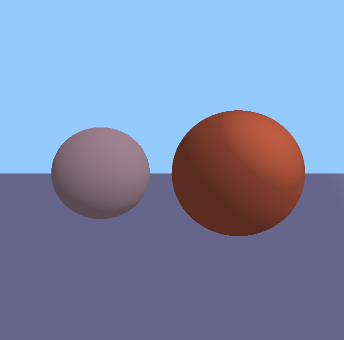
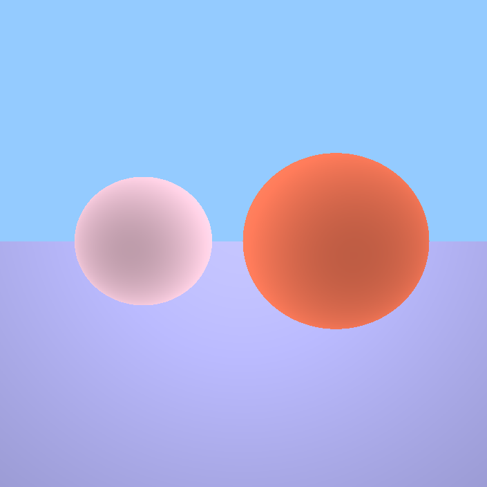
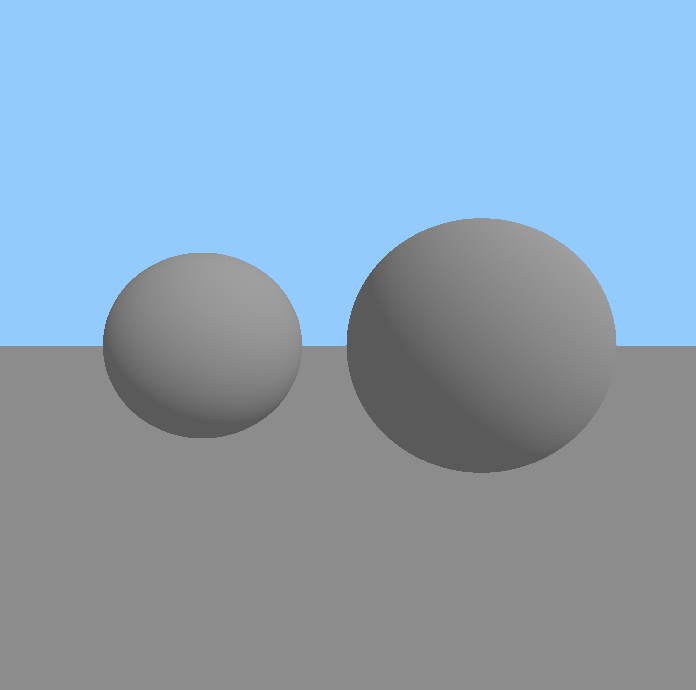

# RayCasting

*Идею и некоторые куски кода взял с канала [Onigiri](https://www.youtube.com/channel/UCzdmz_lLWT_dPqOvFjXAMVg).*  
*А именно из этого видео: https://www.youtube.com/watch?v=TTqLX0OHZzI.*

## Описание
- __[Wikipedia](https://ru.wikipedia.org/wiki/Ray_casting)__
- __Описание:__
  - Минимальная реализация рейкастинга на языке C# и библиотеки OpenTK.
- __Проделанная работа:__
  - Созданы два объекта - сфера и плоскость.
  - Реализовано освещение объектов и отражение лучей от их поверхностей.
  - Возможность создавать несколько объектов, источников освещения и располагать объекты в любых координатах.
  - Поворот камеры, объекта и источника света.

## Примеры

